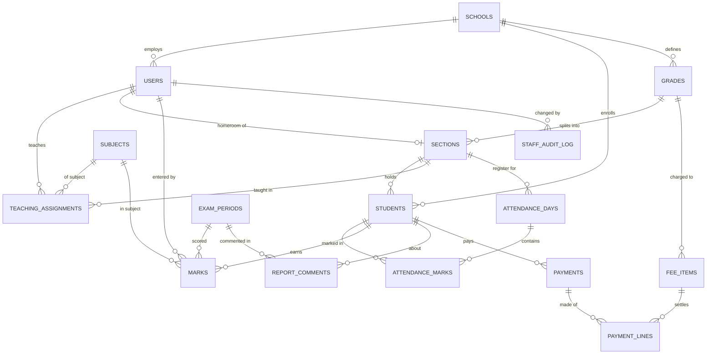

# HoneyBadger School — Architecture

Two halves:

- **Part 1–2** describe what exists today: a front-end-only prototype, all data
  in the browser.
- **Part 3** describes the database it should become when a real backend lands.
  Nothing in Part 3 is built yet.

---

## 1. Architecture as built

### Stack

React 18 + TypeScript, Vite, Tailwind, React Router (hash routing so it works
on any static host), Zustand for session only. No other state library, no data
library. ~5,100 lines across 40 files.

### The one data pattern

```
components ──read──▶  useDb()          src/services/db.ts — the client cache
components ──write─▶  services/*.ts    async functions; the ONLY mutation path
services   ──commit▶  update(draft)    new snapshot → localStorage → re-render
```

Three rules that the whole codebase obeys (verified in audit, zero violations):

1. Components **never** import `src/data/` — only `db.ts` knows the seed exists.
2. Components **never** call `update()` or `getDb()` — they call a service.
3. Reads are synchronous from the cache, so there are no loading spinners.

**This is the seam.** To attach a real backend you rewrite the *bodies* of
`services/*.ts` as `fetch` calls and hydrate `db.ts` from the server. No screen
changes, because no screen knows where data comes from.

### Layout

```
src/
  data/seed.ts        deterministic demo school (one PRNG seed → same school every reset)
  services/           db, students, staff, fees, exams, attendance, compliance, settings
  lib/                derive.ts (pure calculations), dates.ts, money.ts
  store/              session.ts (role + who), online.ts
  components/         Shell, Modal, Print, Icon, Toast, bits (Avatar/PageTitle/EmptyState/SaveChip)
  pages/admin/        Dashboard, Students, StudentProfile, Fees, Exams, Staff, StaffProfile, Settings
  pages/teacher/      MyClasses, Attendance, MarkEntry, MyStudents
  i18n.ts             every user-facing string; `am` overrides `en` key by key
```

`lib/derive.ts` holds the calculations that must have exactly one
implementation — roster, class average, **rank**, attendance rate. Nothing
recomputes these locally.

### Cross-cutting mechanisms

**Optimistic saving.** Bulk entry (attendance, marks) writes immediately and
surfaces state through `<SaveChip>`: `idle → saving → local → synced`. Offline
shows "Saved on this phone". Nothing blocks on a network round trip.

**Identity.** Everyone who signs in is a `User` in `db.users`, mirroring
`public.users` (whose id is the `auth.users` id). A `Teacher` and their `User`
share one uuid — server-side they are one row. The session stores `userId` and
`schoolId`; role is an attribute of the user, not the identity.

**Authorship trails.** Anything disputable records *which user* did it:
`db.markAudit[key]` (`enteredByUserId`), `AttendanceRecord.markedByUserId`,
`Payment.receivedByUserId`, `db.auditLog` (`actorUserId`, with before/after).
Users are never deleted, so those ids always resolve — and because a name is
never stored alongside them, renaming somebody re-labels their history instead
of leaving it asserting a name they no longer have.

**Authorization.** `src/config/permissions.ts` maps named capabilities to the
six roles; `useCan()` in components, `assertPermission()` in services. Screens
do not compare role names. This is UI gating, not security — the same rules
must be enforced by RLS server-side.

**Printing.** Documents render in a portal under `<body>`; on print the app
root is `display:none`. Lists that can span pages use `<PaginatedReport>`
(letterhead + `Page N of M` on every sheet); one-record documents use
`PrintHead`/`PrintFoot` inside `.print-page`.

**Schema versioning.** `SCHEMA_VERSION` in `db.ts`. A browser holding an older
snapshot reseeds automatically instead of showing stale data.

---

## 2. Feature tour

### Login

Role select — Administrator, or Teacher (then pick your name). No password:
this is a demo prop, replaced by real auth in Part 3. Departed staff are
excluded from the teacher list, and a session whose teacher no longer exists is
ended rather than silently becoming someone else.

### Admin

**Dashboard** — today's attendance across all classes, fees collected vs
outstanding this term, and a **compliance panel** that queries for missing
work: classes with no register marked today, and subject/class pairs with no
marks entered for the current exam. Each row links straight to the screen that
fixes it. All complete → a positive "all caught up" state, not a blank panel.

**Students** — search matches name, guardian, the system ID and the school's
own number. Filter by grade and class. Profile has four tabs: Personal info
(including both ID numbers), Attendance history, Marks, Fee history.

*Register* pre-fills the next ID number (`2018/0304`); type over it and a
duplicate is blocked inline naming who holds it. Numbering continues from the
highest ever issued, so a manual out-of-sequence number can't cause a later
collision.

*Promote class* moves a whole class up a grade at year end, with per-student
exceptions. Top grade leaves the roll.

**Fees** — fee structure per grade (tuition per term, registration, materials).
Record a payment against a student → printable receipt with a receipt number.
Outstanding balances list, filterable, and a printable defaulters report with
guardian phone numbers.

**Exams** — define exam periods. Report cards show marks per subject, average,
**rank in class**, class average, attendance rate and a homeroom teacher
comment. Print one or all 50 at once (one sheet each).

Ranking is competition ranking on the *printed* (1-decimal) average, so two
students showing 78.2 always share a rank and the next skips — a report card
can never show equal averages at different ranks.

**Staff** — list filtered by status (active / on leave / former). Profile
carries employment (position, type, hire date), contact details (admin-only),
homeroom class, teaching assignments, status, and a full audit log. *Replace
teacher* transfers a whole workload to someone else in one step with a preview
you can deselect from. Staff are never deleted — departing releases their work
but keeps every historical reference intact.

**Settings** — school identity, grade/class structure, academic year and term,
reset demo data.

### Teacher

**My classes** — each assigned class with roster size, subjects, homeroom
badge, and buttons into attendance and marks. Own details below (the only
contact details a teacher can see anywhere).

**Attendance** — pick a class, everyone starts Present, tap only the
exceptions, or "Mark all present". Defaults to today; date picker for
backfilling. Saves optimistically.

**Mark entry** — keyboard-first grid: type, Enter moves to the next student,
running class average, out-of-range values flagged inline and not saved. Empty
is distinct from zero (a student who missed the exam is not one who scored 0).

**My students** — read-only roster with attendance rates.

---

## 3. The database (proposed)

Not built. This is the target when the backend lands.

### Multi-tenancy

One database, ten (or a thousand) schools. Every table carries `school_id`
directly — denormalised on purpose so a security policy is one cheap
comparison, never a join.

`admin` and `teacher` are **roles, not tables**. The seed already has a Vice
Principal who teaches six classes; separate tables would give her two logins
and two identities in the audit trail.

### Entity relationships



### Tables

**Moved to `DATABASE.md`.** That file is now the single source of truth for the
backend schema — every table, column, foreign key, unique constraint and RLS
policy — merged with the Supabase roadmap.

It supersedes what used to be listed here. Seven things changed materially, so
do not build from memory of this section:

- `students.section_id` / `grade_id` → an **`enrollments`** table keyed on
  (student, academic_year). Promotion inserts a row instead of overwriting one,
  so last year's report card still resolves to last year's class.
- `guardian_name` / `guardian_phone` columns → **`guardians`** +
  **`student_guardians`**. Three siblings were three copies of one parent.
- `schools.academic_year` / `current_term` text → **`academic_years`** and
  **`terms`** tables, so historical data can be anchored to a year.
- `exam_periods` + flat `marks` → the **assessment model**
  (`assessment_types`, `subject_weights`, `assessments`, `assessment_scores`).
- `sections.homeroom_user_id` + `previous_homeroom_user_id` → **`class_years`**,
  which fixes the same overwrite bug one year at a time instead of one change
  at a time.
- New: **sync tables** (`change_log`, `sync_devices`, `processed_ops`,
  `school_counters`) and **`teacher_attendance`**.
- `sections` are called **`classes`** there — the roadmap, the schools and the
  UI all say class.

What this section had right and `DATABASE.md` keeps: integer santim,
`payment_lines`, one `users` table rather than split profiles/teachers, roles
not tables, `school_id` on every row, and no hard deletes.

### What changes in the client

| Layer | Change |
|---|---|
| `pages/**` | none — no screen knows where data comes from |
| `lib/derive.ts` | none — pure functions over whatever shape it's handed |
| `services/*.ts` | bodies become `fetch`/Supabase calls |
| `services/db.ts` | hydrates from the API instead of the seed |
| `store/session.ts` | real session: user id + school id + role |
| `data/seed.ts` | becomes onboarding starter data, not a runtime seed |
